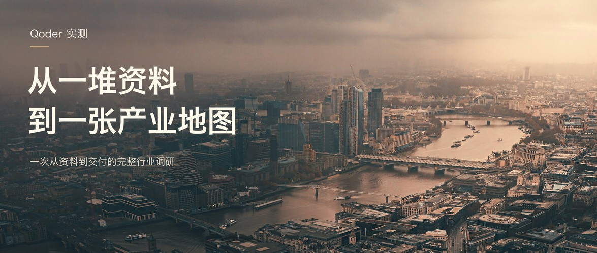

# 公众号实景封面skill

一套面向公众号和长文的实景摄影封面工作流：**先读文章，再找有寓意的大景照片，用克制排版把主题讲清楚。**



默认优先真实摄影，保留照片的空间、光线和质感。选图与构图随文章调整，不固定套用城市照片或同一张模板。

## 它会做什么

1. 阅读正文，判断文章最值得传达的观点或结果。
2. 寻找主题匹配、景别开阔、有视觉寓意且来源清楚的摄影素材。
3. 做等比裁切、轻微调色和简洁排版，让照片承担主要视觉表达。
4. 检查原尺寸成品和手机缩略图。
5. 交付有字版、无字版和素材来源；用户指定照片、尺寸或只要无字版时，按具体要求处理。

默认横版尺寸为 **2350 × 1000（2.35:1）**。这只是工作流默认值，可以修改。

## 安装到 Codex

将这个仓库克隆到个人技能目录，并保留技能文件夹名 `wechat-photo-cover`：

```bash
git clone https://github.com/tuodanZhong/wechat-photo-cover-skill.git "${CODEX_HOME:-$HOME/.codex}/skills/wechat-photo-cover"
```

如果同名技能目录已经存在，请保留现有文件，选择合适的更新方式；上面的命令用于首次安装。

在任务中附上文章内容或链接，然后说：

> 请用 $wechat-photo-cover 给这篇文章做封面，优先有寓意的实景大图，保留有字版和无字版。

也可以直接指定照片、标题或比例：

> 用 $wechat-photo-cover，把我给的照片做成 16:9 的无字封面。

## 本地排版脚本

脚本只处理本地照片，不联网、不调用生图模型。运行需要 Python 3.9+、Pillow 和可用的中文字体。

```bash
python3 -m venv .venv
source .venv/bin/activate
python3 -m pip install -r requirements.txt
python3 scripts/render_cover.py --config references/example-cover.json --output-dir outputs/example
```

以上命令可使用仓库自带的参考照片生成示例。新建配置文件后，替换 `photo` 和文字即可：

```json
{
  "photo": "my-photo.jpg",
  "stem": "article-cover",
  "size": [2350, 1000],
  "focus": [0.5, 0.5],
  "brightness": 1.0,
  "overlay_opacity": 0.3,
  "kicker": "文章主题",
  "title": ["第一行短标题", "第二行短标题"],
  "subtitle": "一行可选的具体说明"
}
```

`photo` 相对路径从配置文件所在目录解析。标题和其他文字均可省略。macOS 默认寻找冬青黑体中文；其他系统可使用 Noto Sans CJK / Source Han Sans，或通过 `font_path` 指定字体。

每次输出有字与无字两组 JPG、PNG，以及宽 470 像素的缩略图。源照片不覆盖。脚本会检查非法裁切、文字越界、重叠和缺字等问题，但最终仍需要看图验收。

完整配置说明见 [渲染用法](references/rendering.md)。

## 文件说明

| 文件 | 用途 |
| --- | --- |
| [SKILL.md](SKILL.md) | 选图、设计、检查和交付工作流 |
| [agents/openai.yaml](agents/openai.yaml) | 技能名称、简介和默认调用提示 |
| [scripts/render_cover.py](scripts/render_cover.py) | 确定性的摄影裁切排版 |
| [references/style-and-example.md](references/style-and-example.md) | 已认可的风格、构图分析和素材出处 |
| [references/rendering.md](references/rendering.md) | 脚本配置说明 |
| [references/example-cover.json](references/example-cover.json) | 可直接运行的示例配置 |

## 示例摄影来源

示例照片由 [Michael Gluzman](https://unsplash.com/photos/aerial-view-of-a-foggy-city-with-a-river-aD0nD0sqUaM) 拍摄，适用 [Unsplash License](https://unsplash.com/license)。仓库内示例经过裁切、轻微亮度调整和文字排版，没有使用 AI 生成或扩展画面。

照片用于表现主题和氛围，不是文章案例的现场图。原作链接和处理记录见 [素材说明](references/style-and-example.md)。
